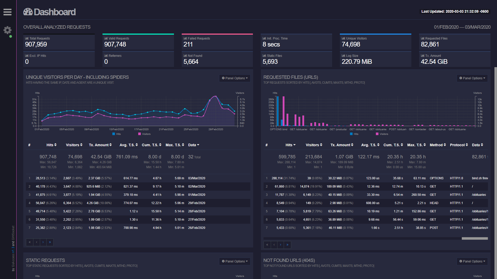
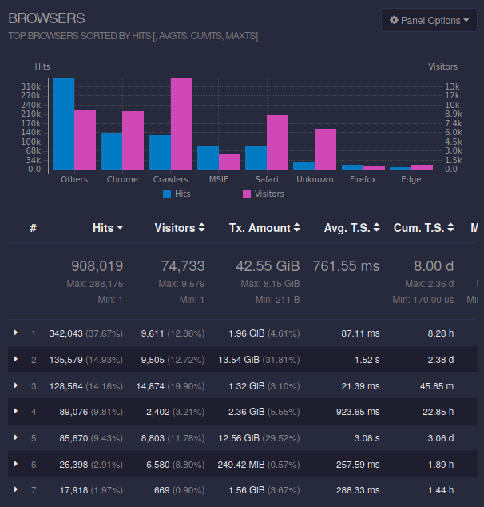

# Aplikasi Web "GoAccess"


## Sekilas Tentang

GoAccess adalah sebuah *real-time web log analyzer* yang *open source* dan visualisasi interaktif yang dapat berjalan di **Terminal** dalam *nix systems atau melalui browser. 


#### Membuat VM Ubuntu Server
Telah tersedia virtual disk image (VDI) instalasi Ubuntu Server 18.04 di direktori /opt/vm. 
Salin file ubuntu-server.vdi tersebut ke direktori home anda. Kemudian, buat VM baru pada VirtualBox dengan tipe "Ubuntu 64-bit". 
Gunakan virtual disk yang sudah disalin tadi.

File VDI di atas dapat diunduh di http://repo.apps.cs.ipb.ac.id/lab/ubuntu-server.vdi.gz.

#### Setting port-forwarding VM

Tujuannya adalah agar VM bisa diakses dari luar melalui alamat IP host (localhost). Masuk ke 'Settings -> Network -> Advanced -> Port Forwarding' dan tambahkan dua aturan berikut.
Dengan demikian, jika kita mengakses port 8000 di host, maka akan diteruskan ke port 80 di guest (VM). Begitu juga dengan SSH, jika kita mengakses port 2200 di host, maka akan diteruskan ke port 22 di guest.
Setelah semuanya beres, jalankan VM dengan mode headless (tanpa tampilan).


### Sebelum Instalasi
* Karena prosesnya dilakukan dalam windows, fungsi ssh tidak terdapat dalam command prompt. Oleh karena itu, kami menggunakan aplikasi pihak ketiga (PuTTY) untuk mengakses virtual mesinnya.
```
Berikut adalah langkah-langkah untuk mengakses VM dengan PuTTY via cmd.
1. Ubah directory cmd ke directory instalasi PuTTY
2. Lalu, masukkan codingan berikut:

"putty.exe -ssh student@localhost 2200"
```
* Sebelum melakukan instalasi paket pada instansi server Ubuntu, sebaiknya melakukan update sistem terlebih dahulu.Log in dengan sudo user dan lakukan perintah berikut ini.
```
> set repo:

sudo tee /etc/apt/sources.list << !
deb http://repo.apps.cs.ipb.ac.id/ubuntu bionic          main restricted universe multiverse
deb http://repo.apps.cs.ipb.ac.id/ubuntu bionic-updates  main restricted universe multiverse
deb http://repo.apps.cs.ipb.ac.id/ubuntu bionic-security main restricted universe multiverse
!

> update system:
sudo apt-get update
sudo apt-get -y upgrade
```
## Instalasi
* #### Instal dependency
```
sudo apt-get -y install libncursesw5-dev gcc make
```
Package opsional
```
sudo apt-get -y install libgeoip-dev libtokyocabinet-dev
```
* #### Instal GoAccess
```
> Download **GoAccess tarball** dengan menjalankan:
wget http://tar.goaccess.io/goaccess-1.2.tar.gz

> Ekstraksi **tarball**:
sudo tar -xzvf goaccess-1.2.tar.gz -C /var/www/html

> Konfigurasi dan instal *package*:
cd goaccess-1.2
sudo ./configure --enable-utf8 --enable-geoip=legacy
sudo make
sudo make install

> Buat soft link dengan goaccess di /usr/bin directory dengan menjalankan:
sudo ln -s /usr/local/bin/goaccess /usr/bin/goaccess

> Sekarang GoAccess sudah terinstal di server anda.
```
* #### Menggunakan GoAccess
```
> GoAccess adalah sebuah **web log analyzer**. Jika tidak ada web server yang dijalankan, instal **Apache web server**:
sudo apt-get -y install apache2

> Start dan enable web server untuk dijalankan di boot time:
sudo systemctl start apache2
sudo systemctl enable apache2

> Izinkan port HTTP yang diperlukan melalui firewall sistem:
sudo firewall-cmd --add-service=http --permanent
sudo firewall-cmd --reload

> Untuk menganalisa log menggunakan GoAccess dari terminal, ketik:
sudo goaccess /var/log/apache2/access.log --log-format=COMBINED

> Untuk *generate* HTML report, ketik:
sudo goaccess /var/log/apache2/access.log --log-format=COMBINED -a -o /var/www/html/report.html

Buka web browser dan arahkan ke URL http://Vultr_Server_IP/report.html menggunakan web browser favorit anda. 
Browser akan melihatkan berbagai tipe statistic menggunakan graf yang interaktif.
```


## Cara Pemakaian

- Tampilan aplikasi web


- Fungsi-fungsi utama
- Isi dengan data real/dummy (jangan kosongan) dan sertakan beberapa screenshot


## Pembahasan
### Penjelasan Log Activity di Go-Acces
#### Unique Visitors
Permintaan HTTP yang memiliki IP yang sama, tanggal yang sama, dan agen yang sama dianggap sebagai kunjungan unik.

#### Requested File
File yang Diminta menunjukkan file yang paling banyak diminta di server web Anda, dan menampilkan kata hit sebagai angka, dan persentase, bersama dengan waktu host dilayani untuk (bandwidth), protokol apa yang digunakan, dan jenis permintaan apa yang digunakan.
<br/>

     
#### Requested Static File
Hanya menyertakan file statis yang paling sering diminta seperti: jpg, css, swf, js, gif, dan tipe file png, dengan metrik yang sama dengan modul terakhir yang disediakan untuk setiap kejadian.
<br/>

#### HTTP 404 URLs
Diberi peringkat seperti modul sebelumnya dengan statistik yang sama, modul ini mencantumkan HTTP 404 berulang atas: Permintaan Tidak Ditemukan Kesalahan, dan URL yang diminta.

#### Host
Informasi lebih rinci tentang host itu sendiri yang terhubung ke server web Anda, seperti jumlah koneksi, alamat IP global mereka, dan beberapa jenis metrik berulang yang sama.

#### Operating System
Di sini sistem operasi host ditampilkan, dan penggunaan OS diberi peringkat. Ini didasarkan pada kunjungan unik, tidak seperti sebagian besar data modul lainnya.

#### Browser
Modul Browser mengikuti konsep yang sama dengan modul terakhir, kecuali dalam hal ini tipe browser host yang digunakan untuk menghubungkan sesi diberi peringkat. Sekali lagi, ini didasarkan pada pengunjung unik, dan bukan total permintaan secara keseluruhan.
<br/>

#### Referral URLs
Jika host yang dimaksud mengakses situs melalui sumber lain, atau ditautkan / dialihkan ke Anda dari host lain, URL tempat mereka dirujuk akan disediakan di sini dalam modul ini.
<br/>

#### Referring Sites
Modul ini hampir identik dengan yang terakhir (URL Perujuk); satu-satunya perbedaan adalah bahwa alamat situs umum ditampilkan, dan bukan titik asal yang tepat untuk rujukan.

#### Keyphrases
Melaporkan kata-kata kunci yang digunakan pada pencarian Google, cache Google, dan Google translate yang mengarah ke server web Anda yang menangani suatu host. Saat ini ini hanya mendukung Google dan tidak ada mesin pencari lainnya.
#### Geo Location
Modul ini berisi ringkasan lokasi geografis yang dipastikan dari alamat IP host yang dikunjungi. Jika tidak dapat menentukan ini, itu akan ditandai sebagai lokasi tidak diketahui.

#### HTTP Status Codes
Kode Status HTTP berisi statistik tentang nilai-nilai keseluruhan kode status dalam permintaan HTTP, diberikan sebagai jumlah dan persentase.

### Kelebihan dari GOACCESS
* Platform ini merupakan platform open source yang berarti gratis untuk siapa saja. Tanpa dipungut biaya, siapa saja dapat menggunakan fasilitas dari goaccess.
* Platform ini sudah mendukung data yang real time, dan juga medukung untuk diakses tanpa browser (dapat diakses lewat ssh atau terminal)

### Kekurangan dari GOACCESS
* Platform ini tidak memiliki integrasi sistem selengkap platform berbayar seperti datadoghq.com yang memiliki lebih dari 400 integrasi sistem.

### Perbandingan dengan Platform Sejenis
* Platform ini sudah memiliki fitur yang cukup baik dan itu semua dapat diakses secara gratis (open source).
* Namun, platform ini secara kelengkapan dan kemudahan dalam melakukan log analysis masih terbilang kurang jika dibandingkan dengan datadoghq.com yang merupakan web analyzer berbayar.

## Referensi
* https://goaccess.io/features
* https://www.datadoghq.com

